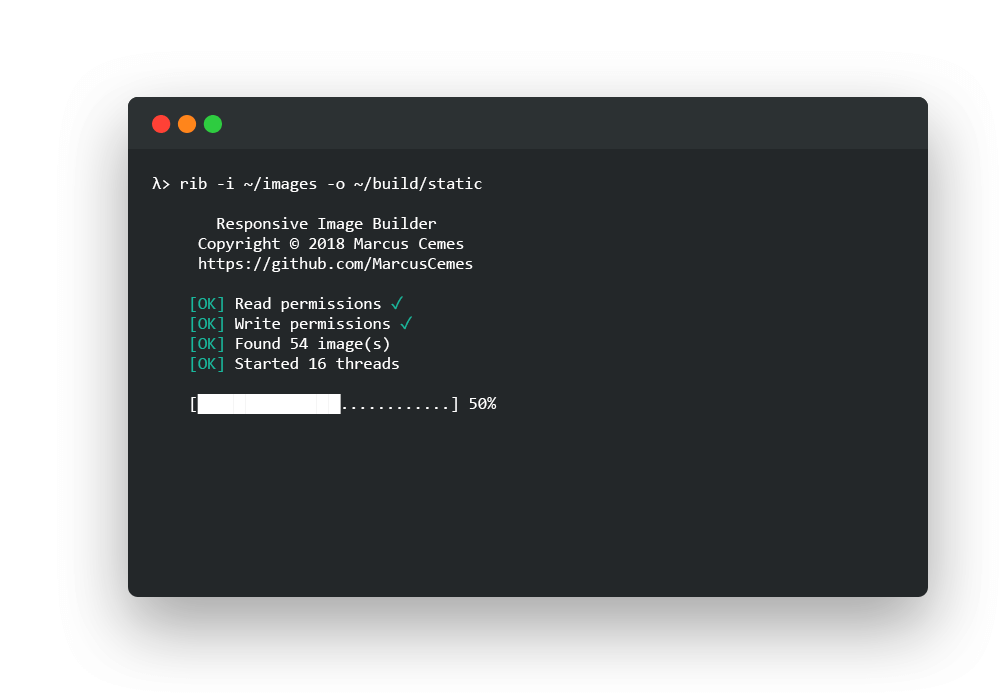

# Responsive Image Builder
[](https://www.npmjs.com/package/responsive-image-builder)
 


An ultra-fast WebP image building pipeline, for the web.

A multithreaded CLI tool and NodeJS module built into one, letting you quickly resize and compress high-resolution images into several sizes in its original format AND the shiny new WebP codec, offering incredible reductions in filesize while looking better than JPEG, and supporting transparency.

<p align="center">
  
</p>


## Table of contents

<!--ts-->
- [Why?](#why?)
  * [How it works](#how-it-works)
    + [Performance](#performance)
- [Getting Started](#getting-started)
  * [Prerequisites](#prerequisites)
  * [Installing](#installing)
- [Usage](#usage)
  * [Exports](#exports)
  * [Where's the magic?](#where's-the-magic?)
    + [A step further... (use case)](#a-step-further...-(use-case))
  * [Some notes on resources](#some-notes-on-resources)
- [JSON Schemas](#json-schemas)
- [Built With](#built-with)
- [Versioning](#versioning)
- [Authors](#authors)
- [License](#license)
- [Acknowledgments](#acknowledgments)
<!--te-->

## Why?
Webpack... Angular... React... PHP... Cloudflare... So many solutions for serving images, some terrible, some paid. What if you just want to *serve modern WebP images with srcset optimization and lazy-loading*, with fallback codecs (*ahem Safari, Firefox, Edge, ...*)? Is that really too much to ask?

This is the EASIEST solution I found, offering cache-busting responsive WebP goodness, with lanczos3 downscaling, and NO server-processing! And it's free!

Oh... Did I mention it's INTELLIGENT? Never upscale! Never fetch duplicate images! The browser will fetch the BEST image from a manifest file (containing all the available files) generated during the build process with RIB.

### How it works

Responsive Image Builder traverses a folder full of images, and converts them one-by-one using a distributed cluster network, keeping the original folder stucture. Each image is resized to fit into each configured preset (without upscaling or duplicates! only unique pictures are exported), before being saved in its original codec and as a WebP image. A list of all exports are written to *manifest.json*, with relative paths (based on the input diretory's folder structure) ready for upload to a web server. With ```optimize: true``` enabled, JPEG and PNG images can have high-quality compression and quantization applied to them, using [mozjpeg](https://github.com/mozilla/mozjpeg) and [pngquant2](https://github.com/kornelski/pngquant) to reduce their size by up to 4x, while retaining perfectaly acceptable quality. See this [example](https://github.com/MarcusCemes/responsive-image-builder/tree/master/example) to see the results for yourself.

If you are using Angular, I've already made a service that can read the manifest.json, and provide easy image resolution for \[src\] and \[srcset\] binding. See [/extra/image.service.ts](https://github.com/MarcusCemes/responsive-image-builder/tree/master/extra/image.service.ts). With some tweaking, this can work with anything.

#### Performance

Responsive Image Builder is focussed on speed. Tasks are distributed amongst a cluster network to maximize the system's resources, a dynamic programming design leverages memory to store RAW image data to accelerate the resizing and conversion process. All image operations are done using the high-performance SHARP library that runs on C++. On an 8 core system, a thousand high-fidelity 4K PNG images (~10GB) are processed in roughly a minute. 

## Getting Started

This is a tool designed to be used during the build process. It uses one of the fastest image downscaling libraries available, [SHARP](https://github.com/lovell/sharp), which used C++ behind the scenes. RIB merely streamlines the image building pipeline.

It's not magic, it's not a fully-fledged standardized process, it's more of a build-script tool. This does mean, however, that it gives you more freedom! The best tools are those that allow you to design the build process, not everybody has NodeJS backend servers whose sole purpose is to serve an Angular app... The usefulness is in the *manifest.json* file. See [Where's the magic?](#where's-the-magic) for ideas on how to use this effectively.
 
### Prerequisites

First of all, you *will* need an installation of NodeJS. Although the hard work is done on C++, SHARP's interface uses NodeJS. Plus, it gives you a very easy way to install the package!

### Installing

First, install `responsive-image-builder`:

```sh
$ npm install --save-dev responsive-image-builder
```

That's it! You may now `require` the module in any NodeJS script:

```javascript
const rib = require('responsive-image-builder');
rib({ input: 'path/to/input', output: '/path/to/output' });
```

You can also add it as an NPM script in your ```package.json```, so that you can simply use ```npm run rib``` inside your repository:

```json
scripts: {
    "rib": "rib -i /path/to/input -o /path/to/output"
}
```

If you want global access from any working directory, add the `--global` flag during the NPM installation for the full CLI companion tool:

```sh
$ npm i -g -D responsive-image-builder
$ rib -i /path/to/input -o /path/to/output
```

## Usage

RIB may be used from the command line, or as a NodeJS module. For examples, see [Getting Started](#installing). The TypeScript-like syntax is:

```typescript
const rib = require('responsive-image-builder');
const configuration = new RIBConfig({...});  // see $schema/config.js
const promise: Promise<RIBResponse> = rib(configuration: (RIBConfig|Object));  // see $schema/response.js
```

Executing `rib({...});` will return a promise. It can be a long wait... You can use this module synchronously with `await rib({...});` or with a callback function `rib({...}).then(() => {...});`.  The promise resolves into a RIBResponse summary (see [$schema/reponse.json](https://github.com/MarcusCemes/responsive-image-builder/tree/master/$schema/response.json)).

Here's a list of arguments/configuration values that can be used. If something is missing, a full list of options is available in the configuration class under ```lib/config.js```.

| CLI flag                   | config key              | default value | description                                                                                              |
|----------------------------|-------------------------|---------------|----------------------------------------------------------------------------------------------------------|
| -i, --input \<path\>         | input \[string\]        | ```null```    | **(required)** Path to the folder containing the images                                                |
| -o, --output \<path\>        | output \[array\]        | ```null```    | **(required)** Path to folder where images are output                                                  |
| -e, --exports \<path\>       | exports \[object\]      | RIBConfig.exports   | [SEE EXPORTS](#exports) **CLI**: Path to file with JSON  **NodeJS**: "Preset" object                     |
| --no-interactive           | interactive \[boolean\] | ```true```    | Interactive command line prompts for deleting, overwriting or creating authorisation                     |
| -f, --force                | force \[boolean\]       | ```false```   | **DANGEROUS!** Delete, create or overwrite files without asking! Make sure you're using the right paths! |
| -c, --clean                | clean \[boolean\]       | ```false```   | Delete the output directory's contents without asking                                                    |
| -t, --max-threads \<number\> | max_threads \[number\]  | ```0```       | The number of threads to use. 0 will use all cores available                                             |
| --shy                      | verbose = 0             | ```2```       | Only report errors                                                                                       |
| -s, --silent               | verbose = 1             | ```2```       | No STDOUT output at all. Careful... The program may wait for input without you knowing.                  |
|                            | verbose = 2             | ```2```       | The default verbosity option, including the banner and progress bar.                                     |
| --no-manifest              | manifest \[boolean\]    | ```true```    | Write a manifest.json summary in the output directory                                                    |
| --no-optimize              | optimize \[boolean\]    | ```true```    | Optimze and compress JPEG and PNG images (mozjpeg+pngquant2)      |

#### Example

```sh
# Command line
$ rib -i path_a -o -path_b --shy -t 8 
```

is the same as doing:

```javascript
// script.js
rib({
    input: "path_a",
    output: "path_b",
    verbose: 1,
    max_threads: 8
});
```
### Exports

Export presets are what the images are resized to. It can either be provided as a Javascript object when using the NodeJS module, or when using the command line, a path to a JSON file containing the exports object. How does it worK? The best way to explain is to show you the default exports object:

```javascript
this.exports = [{
      name: 'thumbnail',
      width: 8,
      height: 8,
      force: true
    },
    {
      name: 'small',
      width: 1280,
      height: 720,
      force: true
    },
    {
      name: 'normal',
      width: 1920,
      height: 1080,
      default: true
    },
    {
      name: 'large',
      width: 3840,
      height: 2160
    }
  ]
```

The default exports object generates four sizes at maximum, resulting in a minimum of 4 files, and a maximum of 8. It generates:

 + A 8x8 *thumbnail*
 + A 1280x720 *small* image
 + A 1920x1080 *normal* image (if not a duplicate of *small*)
 + A 3840x2160 *large* image (if not a duplicate of *large*)

The sizes specified are used to designate a "*box*" that the image should fit into. Each size will only be exported if it results in a different image to the previous export, unless ```force: true``` is present. ```default: true``` is used to "*tag*" the image in the manifest.json file as a good all-round choice for the ```src``` fallback option. The name of the image is used to suffix the image (e.g. ```image_large.webp```), and as a name for the manifest.json image export.

⚠️ *Order the presets from small to large to prevent duplicates. Each export is compared to the previous when deciding whether it should be processed.*

### Where's the magic?

When using [Modernizr](https://modernizr.com/) and Angular's configuration of [Webpack](https://webpack.js.org/) (for example), you can ```require('manifest.json')```. During the build process, the JSON file will be automatically *inlined* in the javascript bundle. How cool is that? *Modernizr* can quickly check for WebP support, and you can then fetch the **BEST** image for your beautiful visitor, and even construct a ```srcset``` property based on each image's unique exports. (8x8 thumbnails are so small, they are also inlined! Awesome!)

#### A step further... (use case)

This is my experience with Angular, it's a little tacky. When using the latest version of Angular, HTML `````` tags are pretty nasty. Angular (as of 2018) uses a complicated Webpack configuration that adds a hashed "fingerprint" to the image filename during the build for cache-busting purposes. CSS image URLs are automatically transformed to the new fingerprinted image, but not `````` URLs. That sucks.

One little secret in Angular is that you can have access to Webpack's ```require``` function by declaring it as an existing global variable:

```typescript
declare var require: any;
```

```require``` has the ability to return the fingerprinted image's URL. It does this by keeping a list of original filenames and the hashed version after building. For example, ```require('image.jpg')``` will return the string path ```"image<hash>.jpg"``` if the file was included during the build process. How do you force all images to be included by Webpack's build process if they are not hardcoded? The ```require``` function takes a mixture of hard-coded paths and varibles, treating the latter as a wildcard. ```require('/path/to/' + image)``` will include ALL FILES in /path/to/ during the build process. It's magic, isn't it?

Angular lets you bind the ```[src]``` property to a javascript (string) variable, this can be done by calling a function. My solution is to create an ```ImageService``` Angular service that handles image requests. It returns an object with a bindable property (objects are always referenced and never duplicated) when called, (for example ```[src]="image_service.fetch('image.jpg').src"```), storing it until WebP support has been decided asynchronously. The stored "shared" objects are then updated with the correct ```src``` and ```srcset``` properties, updating ``````s in real-time.

For a fully working Angular service that handles image src and srcset binding based on the manifest.json from this tool, see [/extra/image.service.ts](https://github.com/MarcusCemes/responsive-image-builder/tree/master/extra/image.service.ts).

### Some notes on resources

NodeJS is not the most optimized of languages. Like most other languages, memory management is handled by the Garbage Collector. It doesn't run very often, either... RIB does image operations on raw image data for the best quality, leveraging memory to reduce I/O disk operations. Large images may use a lot of RAM, which isn't immediately deallocated, even after the variable is unreferenced as soon as possible. In some cases, NodeJS will use *all* RAM available (up to 12GB on 16 threads!), before realising that it should run the GC to deallocate stale memory. There's not much I can do here without sacrificing performance and/or quality. If this is a problem, consider limiting the script's memory somehow... If you have suggestions, post them in the issues section.

## JSON Schemas

The RIBConfig object, RIBResponse object and manifest.json file conform to [https://json-schema.org/](https://json-schema.org/)'s drafts. Their respective schemas are available under [$schema/](https://github.com/MarcusCemes/responsive-image-builder/tree/master/%24schema). 


## Built With

* [NodeJS](https://nodejs.org) - Powered by Chrome's V8 Javascript engine
* [SHARP](https://github.com/lovell/sharp) - A beautiful and extremely powerful image manipulation library

### Size

This package will add ~100MB to your *node_modules* folder. Despite being only ~500B, the libraries used for high-quality image manipulation take up a lot of space.
In the future, I would like to convert this tool into a C++ application, benefitting from the efficiency of binaries instead of heavy dependencies.

## Versioning

We use [SemVer](http://semver.org/) for versioning. For the versions available, see the [tags on this repository](https://github.com/MarcusCemes/responsive-image-builder/tags). 

## Authors

* **Marcus Cemes** - *Project Owner* - [Website](https://mastermovies.co.uk/) - [GitHub](https://github.com/MarcusCemes)

## License

This project is licensed under the **Apache 2.0** License - see the [LICENSE.md](LICENSE.md) file for details

## Acknowledegments

* [SHARP](https://github.com/lovell/sharp) is amazing. It's the workhorse behind this script.
* [Chalk](https://github.com/chalk/chalk) for providing pretty colours.