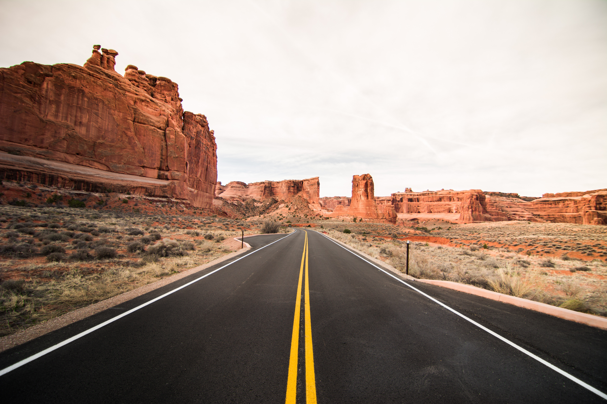

# An example Responsive Image Builder export

The original picture from Unsplash is 4MB. It measures 6000x4000.

 

The export contains the pictures obtained with RIB using the default configuration. The standard-sized WebP image is only 134KB! That's roughly a 25% reduction in size and bandwidth compared to its identical JPEG twin.

This is the kind of reduction that you can expect from WebP while maintaining the same or slightly superior quality. By playing with the encoding settings, you could drive those file-sizes down even further.

See for your self!

 

A decent 1620x1080 JPEG export that is 180KB

 

A superior 1620x1080 JPEG WebP that is 134KB. Can you tell the difference?

 

Photo by Nathaniel Foong on [Unsplash](https://unsplash.com/photos/OVfKK18xzHA)